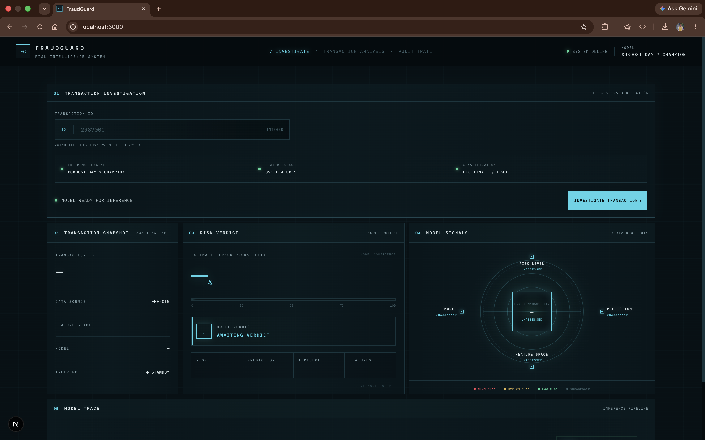
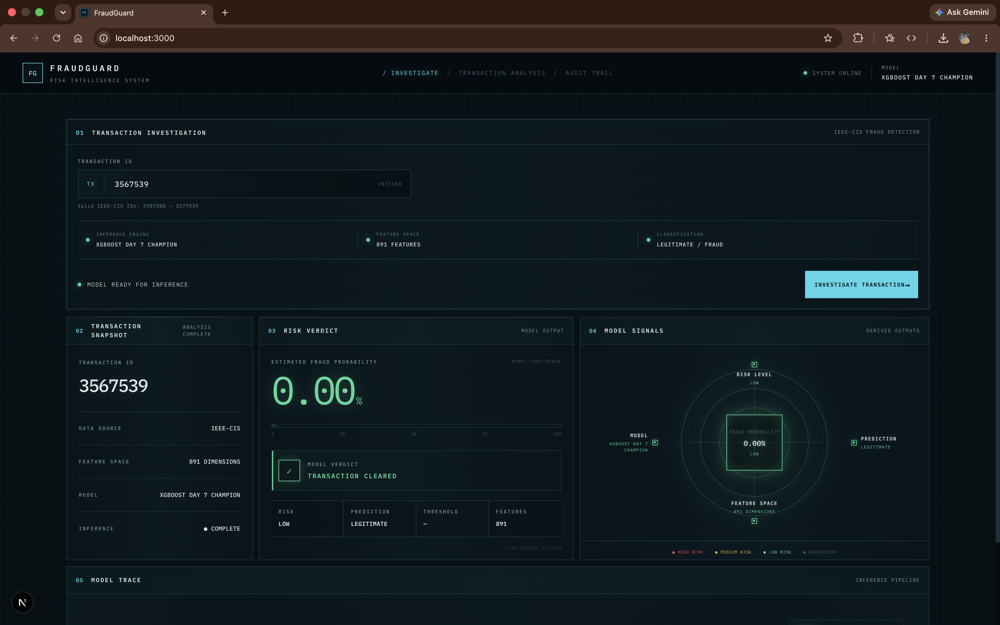

# FraudGuard

### Transaction-Level Fraud Detection & Investigation System

FraudGuard is an end-to-end fraud detection application built around a real machine-learning pipeline and presented through an investigation-focused interface.

It takes a valid transaction ID from the **IEEE-CIS Fraud Detection dataset**, sends the transaction through a FastAPI inference service, evaluates it with the **XGBoost Day 7 Champion model**, and turns the model output into an analyst-friendly investigation view.

> **“What does the model think about this transaction, and how risky is it?”**

The final system connects data preparation, trained ML artifacts, preprocessing, inference, an API layer, and a dedicated Next.js dashboard into one working application.

---

## FraudGuard in Action

### Investigation Console

The main interface is designed as an investigation console rather than a conventional analytics dashboard.



---

### Transaction Analysis

A transaction ID is entered and sent through the complete inference pipeline.



---

## 01 — What FraudGuard Does

A user enters a transaction ID into the investigation console.

FraudGuard then:

1. Validates that the transaction ID belongs to the supported IEEE-CIS transaction range.
2. Sends the transaction ID to the FastAPI `/predict` endpoint.
3. Loads the stored preprocessing artifacts and trained XGBoost model.
4. Reconstructs the transaction feature representation used during training.
5. Runs model inference across an **891-feature inference space**.
6. Produces a fraud probability and binary prediction.
7. Converts the model result into:
   - `LOW`
   - `MEDIUM`
   - `HIGH`
8. Returns the result to the frontend.
9. Presents the result through the FraudGuard investigation dashboard.

The result is a complete ML-to-application workflow rather than an isolated model.

---

## 02 — Why This Project Exists

Fraud detection is an inherently difficult machine-learning problem.

The dataset used by FraudGuard contains a large number of legitimate transactions compared with fraudulent ones. That imbalance means that simply achieving high overall accuracy is not enough.

FraudGuard therefore focuses on the full inference pipeline:

**raw transaction → preprocessing → feature representation → XGBoost → probability → risk classification → investigation UI**

This project brings together:

- Machine Learning
- Feature engineering
- Model experimentation
- Model persistence
- API development
- Frontend engineering
- Input validation
- Real-time inference
- Data-driven UI design

---

## 03 — Dataset

FraudGuard was developed using the **IEEE-CIS Fraud Detection** dataset.

| Metric | Value |
|---|---:|
| Total transactions | 590,540 |
| Legitimate transactions | 569,877 |
| Fraudulent transactions | 20,663 |
| Fraud rate | ~3.5% |

The original dataset is organized around transaction and identity information.

FraudGuard works with:

- `train_transaction.csv`
- `train_identity.csv`
- `test_transaction.csv`
- `test_identity.csv`

The raw dataset is intentionally excluded from Git through `.gitignore`.

---

## 04 — Machine Learning Pipeline

The ML side of FraudGuard was developed progressively through dedicated notebooks.

### Dataset Audit

`01_dataset_audit.ipynb`

Used to understand:

- Dataset dimensions
- Target distribution
- Missing values
- Numerical variables
- Categorical variables
- Transaction amount distribution
- Transaction timing
- Card-related behaviour
- Email-domain behaviour
- Identity information

### Feature Engineering

`02_feature_engineering.ipynb`

Focused on transforming the raw transaction data into a model-ready representation.

### Model Improvement

`03_model_improvement.ipynb`

Used for model experimentation and evaluation.

### Error Analysis & Model Insights

`04_error_analysis_and_model_insights.ipynb`

Focused on understanding model behaviour rather than treating the prediction as a black-box number.

### Model Explainability

`04_model_explainability.ipynb`

Used to investigate the model's learned feature behaviour.

### Hard Fraud Features

`05_hard_fraud_features.ipynb`

Focused on stronger fraud-oriented feature signals and improving the final modeling pipeline.

---

## 05 — Final Model

The production inference path uses the:

# XGBoost Day 7 Champion

The final API loads the trained champion model together with the preprocessing artifacts required to reproduce the training-time feature representation.

The API reports:

```text
Model: XGBOOST DAY 7 CHAMPION
Feature space: 891 FEATURES
Classification: LEGITIMATE / FRAUD
````

The stored model and preprocessing artifacts are located under:

```text
api/model/
```

Important artifacts include:

* `xgb_day7_champion.pkl`
* `categorical_encoder.pkl`
* `categorical_features.pkl`
* `categorical_maps.pkl`
* `custom_screening_metadata.pkl`
* `custom_screening_model.pkl`
* `feature_names.csv`
* `numerical_features.pkl`
* `numerical_imputer.pkl`

These files allow the API to perform inference without retraining the model.

---

## 06 — Risk Classification

FraudGuard does not expose only the raw binary prediction.

The model first produces:

```text
fraud_probability
```

and:

```text
prediction
```

The application then represents the result using a risk level:

| Risk   | Meaning                                                   |
| ------ | --------------------------------------------------------- |
| LOW    | Transaction has a comparatively low estimated fraud risk  |
| MEDIUM | Transaction requires increased attention                  |
| HIGH   | Transaction has a comparatively high estimated fraud risk |

This makes the model output easier to interpret inside an investigation workflow.

The API response also exposes the classification threshold when available.

---

## 07 — Application Architecture

```text
                         FRAUDGUARD

                             │
                             ▼

                  ┌────────────────────┐
                  │   Next.js Frontend │
                  │   Investigation UI │
                  └──────────┬─────────┘
                             │
                     Transaction ID
                             │
                             ▼
                  ┌────────────────────┐
                  │    FastAPI API     │
                  │      /predict      │
                  └──────────┬─────────┘
                             │
                             ▼
                  ┌────────────────────┐
                  │ Transaction Data   │
                  │ + Preprocessing    │
                  └──────────┬─────────┘
                             │
                             ▼
                  ┌────────────────────┐
                  │ XGBoost Champion   │
                  │   891 Features     │
                  └──────────┬─────────┘
                             │
                             ▼
                 Probability + Prediction
                             │
                             ▼
                     Risk Classification
                             │
                             ▼
                  ┌────────────────────┐
                  │ Investigation      │
                  │ Dashboard          │
                  └────────────────────┘
```

---

## 08 — Backend

FraudGuard uses **FastAPI** as its inference layer.

Main backend entry point:

```text
api/main.py
```

The API exposes the prediction endpoint:

```text
POST /predict
```

### Request

```json
{
  "TransactionID": 2987000
}
```

### Response

A successful response follows the application's `PredictionResult` structure:

```json
{
  "transaction_id": 2987000,
  "fraud_probability": 0.005645,
  "prediction": 0,
  "risk_level": "LOW",
  "model": "XGBOOST DAY 7 CHAMPION",
  "features": 891
}
```

A prediction of:

```text
0 → LEGITIMATE
1 → FRAUD
```

is returned alongside the probability and risk classification.

---

## 09 — Frontend

The frontend is built with **Next.js, React, TypeScript and CSS**.

The interface is intentionally designed as an investigation console rather than a generic dashboard.

### Main interface sections

#### Transaction Investigation

The user enters a transaction ID.

The interface provides:

* Integer validation
* Minimum and maximum transaction ID boundaries
* Transaction ID suggestions
* Loading state
* API error state
* Model readiness status
* Feature-space information
* Classification information

#### Transaction Snapshot

Displays the investigated transaction and its returned state.

#### Verdict Panel

Displays the model's fraud probability and final risk classification.

The panel dynamically reflects:

* LOW
* MEDIUM
* HIGH

risk states.

#### Risk Evidence

Provides a visual representation of the returned risk state and supporting signals.

#### Model Trace

Shows the progression of the transaction through the FraudGuard inference workflow.

---

## 10 — Frontend Architecture

```text
frontend/

│
├── app/
│   ├── globals.css
│   ├── layout.tsx
│   └── page.tsx
│
├── components/
│   ├── Footer.tsx
│   ├── Header.tsx
│   ├── InvestigationPanel.tsx
│   ├── ModelTrace.tsx
│   ├── RiskEvidence.tsx
│   ├── SnapshotPanel.tsx
│   ├── TransactionForm.tsx
│   └── VerdictPanel.tsx
│
└── lib/
    └── api.ts
```

### Core frontend flow

```text
TransactionForm
       │
       ▼
predictTransaction()
       │
       ▼
FastAPI /predict
       │
       ▼
PredictionResult
       │
       ▼
Home
 ┌─────┼───────────────┐
 ▼     ▼               ▼
Snapshot  Verdict   Risk Evidence
                         │
                         ▼
                     Model Trace
```

---

## 11 — Transaction ID Validation

FraudGuard does not allow arbitrary values to be sent to the model.

The frontend validates the supported IEEE-CIS transaction range:

```text
MIN_TRANSACTION_ID = 2987000
MAX_TRANSACTION_ID = 3577539
```

The input must be:

* Numeric
* An integer
* Within the supported transaction range

This prevents obviously invalid transaction IDs from reaching the inference API.

The interface also provides a small set of valid example IDs through the transaction input suggestions.

---

## 12 — Project Structure

```text
Fraudguard/

│
├── api/
│   ├── main.py
│   ├── save_preprocessing.py
│   ├── test_inference.py
│   │
│   └── model/
│       ├── categorical_encoder.pkl
│       ├── categorical_features.pkl
│       ├── categorical_maps.pkl
│       ├── custom_screening_metadata.pkl
│       ├── custom_screening_model.pkl
│       ├── feature_names.csv
│       ├── numerical_features.pkl
│       ├── numerical_imputer.pkl
│       └── xgb_day7_champion.pkl
│
├── data/
│   ├── raw/
│   └── processed/
│
├── docs/
│   └── screenshots/
│       ├── fraudguard-dashboard.png
│       ├── transaction-investigation.png
│       ├── risk-verdict.png
│       └── model-trace.png
│
├── frontend/
│   ├── app/
│   ├── components/
│   ├── lib/
│   ├── package.json
│   ├── package-lock.json
│   ├── next.config.ts
│   ├── postcss.config.mjs
│   ├── eslint.config.mjs
│   └── tsconfig.json
│
├── notebooks/
│   ├── 01_dataset_audit.ipynb
│   ├── 02_feature_engineering.ipynb
│   ├── 03_model_improvement.ipynb
│   ├── 04_error_analysis_and_model_insights.ipynb
│   ├── 04_model_explainability.ipynb
│   ├── 05_hard_fraud_features.ipynb
│   ├── day7_experiment_results.csv
│   └── xgb_day7_champion.pkl
│
├── scripts/
│   ├── train_custom_model.py
│   └── test_custom_model_real.py
│
├── .gitignore
├── README.md
└── project_log.md
```

### Repository hygiene

Generated and environment-specific files are intentionally excluded from version control, including:

* Python cache files
* Jupyter checkpoints
* `.DS_Store`
* Virtual environments
* Next.js build output
* `node_modules`
* Environment files
* Raw/processed dataset directories
* Temporary experiment artifacts

This keeps the repository focused on the actual application, model artifacts, notebooks, and source code.

---

## 13 — Tech Stack

### Machine Learning

* Python
* Pandas
* NumPy
* Scikit-learn
* XGBoost
* JupyterLab

### Backend

* FastAPI
* Uvicorn
* Python
* REST API
* Pickle-based model persistence

### Frontend

* Next.js
* React
* TypeScript
* CSS
* IBM Plex Mono
* Inter

### Development & Tooling

* Git
* GitHub
* npm
* Jupyter
* macOS / Unix development environment

---

## 14 — Running FraudGuard

### Backend

From the project root:

```bash
uvicorn api.main:app --reload --port 8000
```

The API will be available at:

```text
http://127.0.0.1:8000
```

The prediction endpoint is:

```text
POST http://127.0.0.1:8000/predict
```

### Frontend

Open another terminal:

```bash
cd frontend
npm install
npm run dev
```

The Next.js development server will normally be available at:

```text
http://localhost:3000
```

Open the frontend and enter a supported transaction ID.

---

## 15 — Testing the API Directly

The API can also be tested without the frontend.

Example:

```bash
curl -X POST http://127.0.0.1:8000/predict \
-H "Content-Type: application/json" \
-d '{"TransactionID": 2987000}'
```

Example response:

```json
{
  "transaction_id": 2987000,
  "fraud_probability": 0.005645,
  "prediction": 0,
  "risk_level": "LOW",
  "model": "XGBOOST DAY 7 CHAMPION",
  "features": 891,
  "label_mapping": {
    "0": "LEGITIMATE",
    "1": "FRAUD"
  }
}
```

---

## 16 — Model Development Artifacts

The repository preserves the development trail that led to the final inference system.

The notebooks document the progression from:

```text
Dataset Audit
      ↓
Feature Engineering
      ↓
Model Improvement
      ↓
Error Analysis
      ↓
Model Explainability
      ↓
Hard Fraud Features
      ↓
Champion Model
      ↓
FastAPI Inference
      ↓
Investigation Dashboard
```

Experiment outputs and intermediate models that were not part of the final application were removed from the finalized repository.

This keeps the final project clean while retaining the notebooks and artifacts that explain the actual modeling workflow.

---

## 17 — Design Philosophy

FraudGuard deliberately avoids presenting itself as a notebook wrapped in a web page.

The interface was designed around an investigation workflow:

### Identify

```text
TRANSACTION ID
```

### Analyze

```text
FRAUD PROBABILITY
```

### Classify

```text
LOW / MEDIUM / HIGH
```

### Investigate

```text
SNAPSHOT
RISK EVIDENCE
MODEL TRACE
```

The visual language uses a dark technical interface, monospace typography, structured panels, status indicators, and risk-dependent accents to make the system feel like an operational fraud investigation console.

---

## 18 — What Makes FraudGuard an End-to-End Project

FraudGuard covers the complete path from data to deployed-style inference:

```text
                    DATA
                     │
                     ▼
              Dataset Analysis
                     │
                     ▼
             Feature Engineering
                     │
                     ▼
               Model Training
                     │
                     ▼
             Model Evaluation
                     │
                     ▼
              Champion Model
                     │
                     ▼
           Saved ML Artifacts
                     │
                     ▼
              FastAPI Service
                     │
                     ▼
             Transaction Input
                     │
                     ▼
                Inference
                     │
                     ▼
           Probability + Verdict
                     │
                     ▼
             Next.js Dashboard
```

That makes FraudGuard more than a fraud-classification model.

It is a complete **machine-learning application**.

---

## 19 — Final Project Snapshot

| Component         | Final Implementation         |
| ----------------- | ---------------------------- |
| Dataset           | IEEE-CIS Fraud Detection     |
| Transactions      | 590,540                      |
| Fraud cases       | 20,663                       |
| Fraud rate        | ~3.5%                        |
| Model             | XGBoost Day 7 Champion       |
| Feature space     | 891 features                 |
| Backend           | FastAPI                      |
| Frontend          | Next.js + React + TypeScript |
| Input             | Transaction ID               |
| Prediction        | Legitimate / Fraud           |
| Risk levels       | Low / Medium / High          |
| API endpoint      | `POST /predict`              |
| Model persistence | Pickle artifacts             |
| UI                | Investigation dashboard      |
| Version control   | Git                          |

---


## Author

**Ayush Kumar**

B.Tech — Computer Science & Engineering, Data Science

Built as an end-to-end machine learning project combining:

**Machine Learning + Backend Engineering + Frontend Engineering + Data Analysis**

---

> **FraudGuard — From transaction ID to fraud verdict.**
